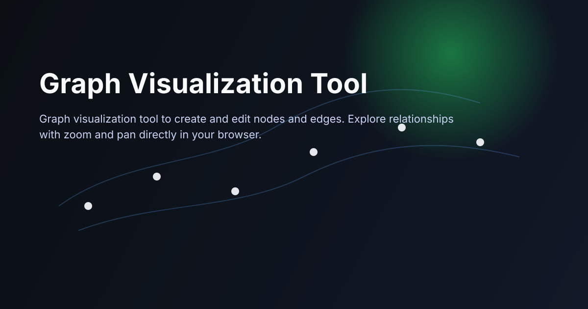

<div align="center">
  
	<h1>Graph Visualization</h1>
	
	
	
	
	
	

  <p>Web-based graph visualization and editing tool. Build nodes and edges in seconds, then explore structure with smooth zoom and pan.</p>
</div>

## Features

- Interactive graph visualization
- Graph editor for nodes and edges
- Zoom and pan navigation

## Usage

- Add a few nodes and connect them with edges
- Drag nodes to explore structure and spacing
- Zoom and pan to inspect dense areas

## Edge support

- Directed and undirected graphs
- Self-loops are allowed
- Between two nodes, you can have only one undirected edge (A -- B)
- Between two nodes, you can have up to two directed edges (A -> B and B -> A)
- Parallel edges in the same direction are not allowed
- You cannot mix a directed edge and an undirected edge between the same two nodes

## Quick start

```bash
npm install
npm run dev
```

Then open http://localhost:3000

## Docker (optional)

```bash
npm run docker-dev
```
